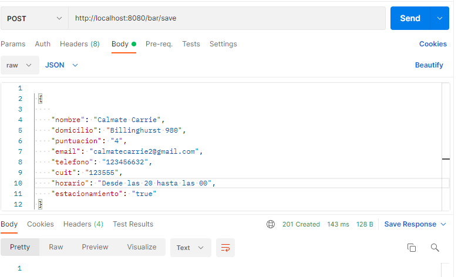
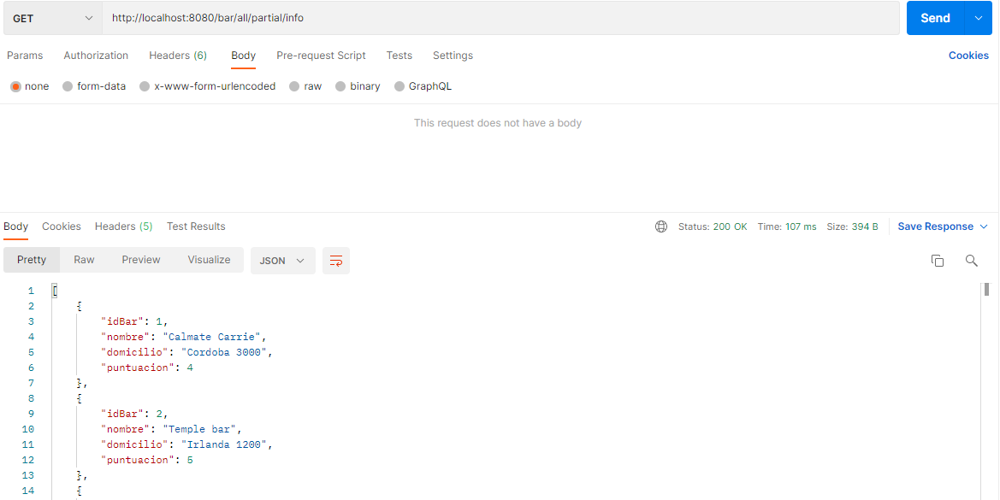
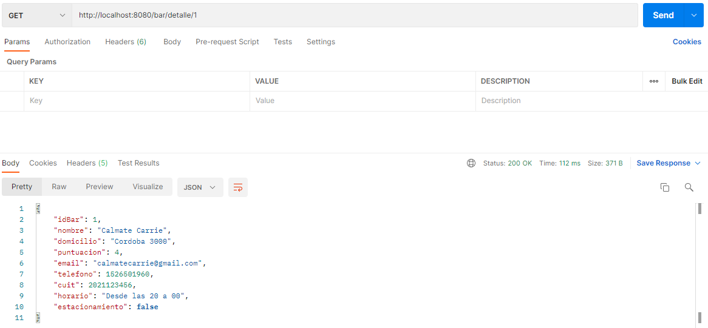

# EJERCICIO EXPERTA

El ejercicio consistió en hacer un backend ( Api Rest ) que permite administrar bares, 
hacer registro de bares, consultar listado de bares con datos parciales (nombre, domicilio y puntuacion) , eliminar algun bar,
o tambien ver el detalle ampliado de un bar ( nombre, domicilio, puntuación, email, tel, cuit, horario y si posee o no estacionamiento). 
En resumen el sistema permite agregar, consultar detalles, listar y eliminar los bares.

##  Consideraciones
Para cargar la base de datos en memoria H2 se deber ejecutar el endpoint
Post: http://localhost:8080/bar/init .

Internamente este endpoint controla si la tabla de Bares esta vacia la carga si no esta vacia
 entonces la deja cargada como esta.

## Requerimientos del sistema:

####Tener instalado y configurado:

- [x] Java 8 - JDK (openjdk-1.8.0): `<link>`  https://docs.oracle.com/en/java/javase/index.html
- [x] Maven 3:  `<link>` https://maven.apache.org/download.cgi
- [x] Git client: `<link>`https://www.atlassian.com/git/tutorials/install-git

####Para correr la aplicación
- Clonar el repositorio
  `<link>`: https://github.com/BrigitteAlejandra19/SpringbootH2ApiRestExperta.git
- Parados en la raíz del proyecto desde la terminal, ejecutar:
  `$ mvn clean install`
- Para correr la app usando el jar Java file desde la terminal:
  `$ java -jar ./target/EjercicioExperta-0.0.1-SNAPSHOT.jar`

## Tecnologias y herramientas utilizadas
- [x] Springboot.
- [x] Github.
- [x] Java 
- [x] H2 database
- [x] lombok.
- [x] Postman: [Descargar collection aqui](https://github.com/BrigitteAlejandra19/SpringbootH2ApiRestExperta/blob/master/postman)
- [x] Intellij ide.

### Arquitectura utilizada
Se realizo una arquitectura de Rest Api con el servidor que nos proporciona Sprigboot donde se agregaron las siguientes capas: 
1) Controllador: contiene los endpoinds solicitados en el ejercicio
2) Servicio: Contiene la logica de negocio para conectarse a la capa de datos
3) Repositorio: contiene la logica del acceso a los datos (JPA)

### Posibles mejoras
- Clean code
- Agregar las validaciones para los diferentes enpoinds que solicitan parametros de entrada.
- Mejorar las excepciones
-completar los casos de prueba ya que se realizo un par como muestra.
- Dockerizar
- Documentar con Swagger


##Documentacion

1) Endpoint para cargar bares a la base de datos:

   ####Curl　

```javascript
curl --location --request POST 'http://localhost:8080/bar/init' \
--header 'Content-Type: application/json' \
--data-raw '
 {
     "nombre": "Calmate Carrie",
    "domicilio": "Billinghurst 980",
    "puntuacion": "4",
    "email": "calamtecarrie2@gmail.com",
    "telefono": "123456632",
    "cuit": "123555",
    "horario": "12:30:00",
    "estacionamiento": "si"
 }
 ```   
2) Endpoint para guardar bares a la base de datos:


####Curl
```
curl --location --request POST 'http://localhost:8080/bar/save' \
--header 'Content-Type: application/json' \
--data-raw '
 {
    
    "nombre": "Calmate Carrie",
    "domicilio": "Billinghurst 980",
    "puntuacion": "4",
    "email": "calmatecarrie2@gmail.com",
    "telefono": "123456632",
    "cuit": "123555",
    "horario": "Desde las 20 hasta las 00",
    "estacionamiento": "true"
 }
```
3) Endpoint para mostrar una lista con todo el detalle de todos los bares:

   ####Curl
```
curl --location --request GET 'http://localhost:8080/bar/all'
```
4) Endpoint para mostrar nombre, domicilio y puntuacion de los bares:
    

```
curl --location --request GET 'http://localhost:8080/bar/all/partial/info'
```
5) Endpoint para mostrar todo el detalle de un bar por ID:

```
curl --location --request GET 'http://localhost:8080/bar/detalle/1'
```

6) Endpoint para eliminar un bar por ID:


```
curl --location --request DELETE 'http://localhost:8080/bar/1'
```